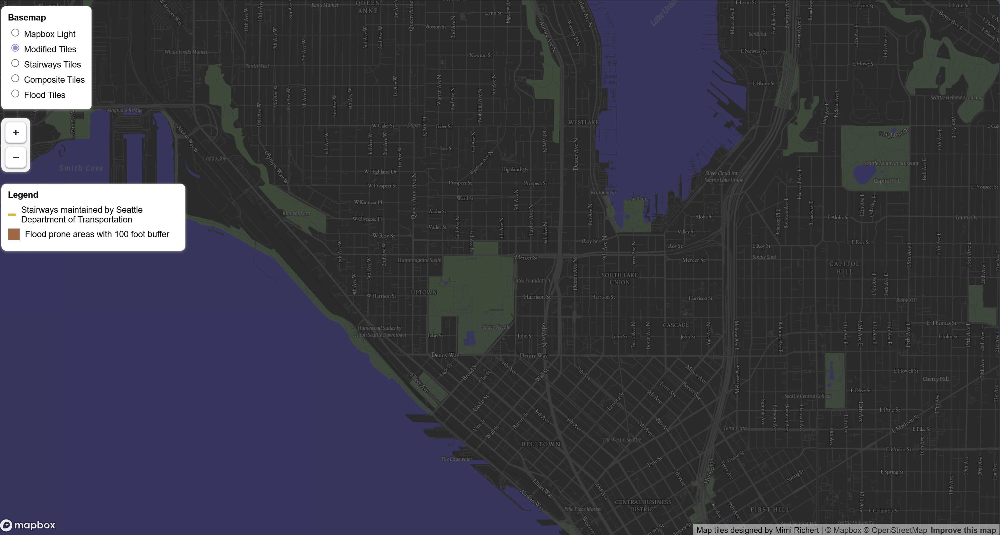
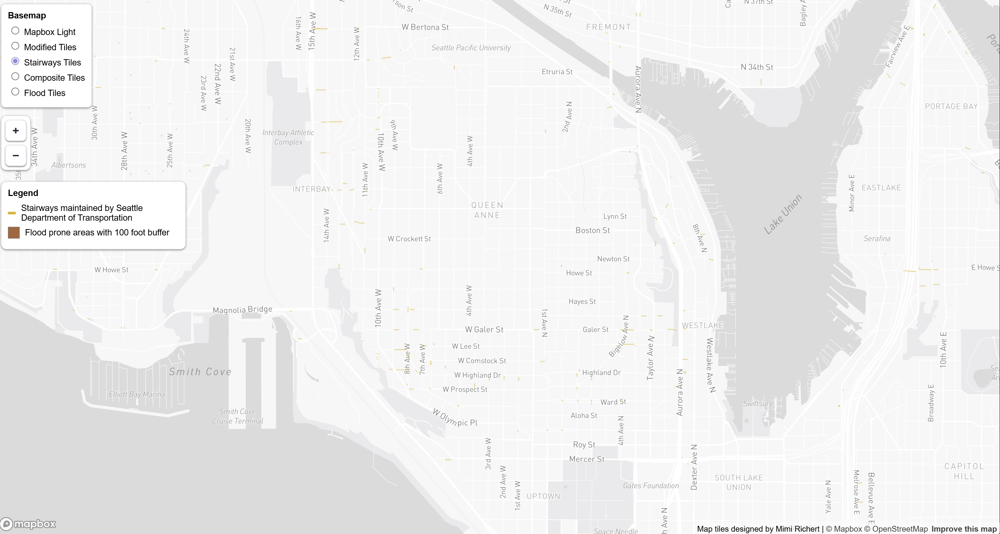
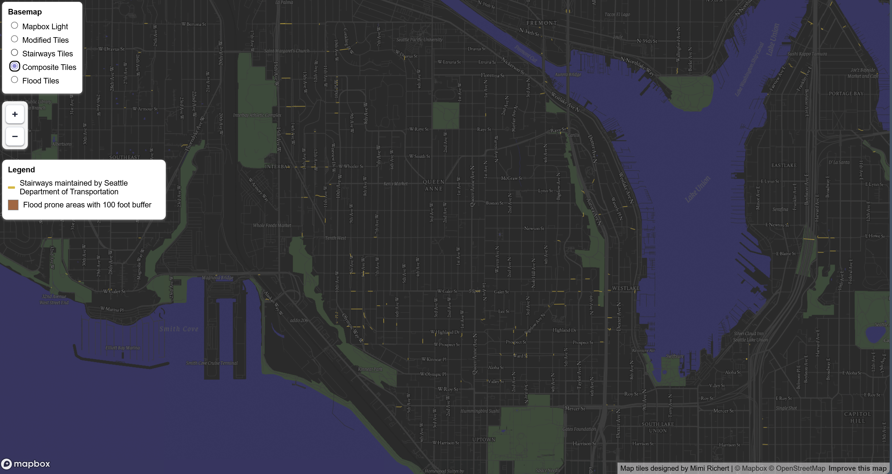
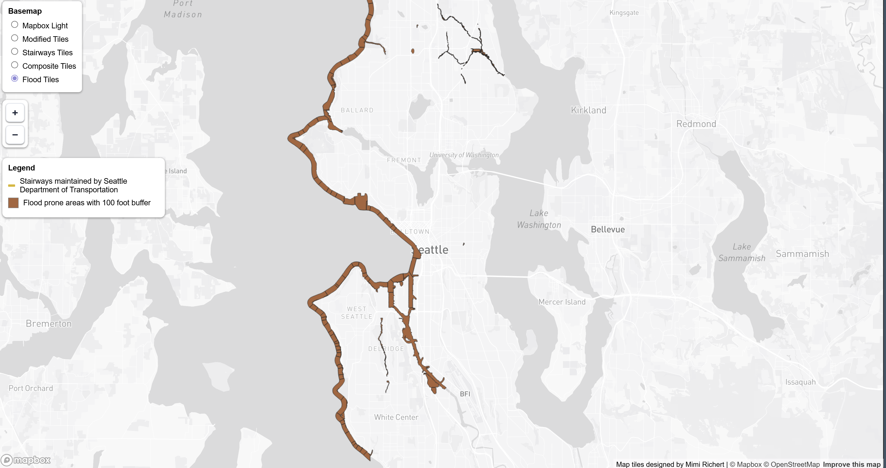

### This map examines the Seattle area.
### [View Map](https://emrichert.github.io/maptile/index.html)

#### Available Zoom Levels
* Modified Basemap: 10-16

* Stairways: 11-15

* Composite: 10-16

* Flood 11-15

#### Brief Descriptions of Tile Sets
* The modified tile set takes the standard Dark Map Box style and adjusts the color of water and waterways to a dark blue and land use and national parks as a dark green. The further you zoom out the more green the rest of the continental parts of the map turn green from the original dark grey. The font was also changed to Faustina (Regular, Bold, Italic).
* The second tile set is of the stairways maintained by the Seattle Department of Transportation. The data is from SDOT on the Seattle Geodata site.
* The third tileset is the composite tileset of the modified tileset with the stairway tile set with transparency set to 100. The yellow was specifically chosen to stand out against the dark basemap.
* The fourth tile set maps the FEMA flood prone areas of Seattle set against the original monotone mapstyle. This layer is used by the City as an aid to evaluate construction sites for the presence of flood prone areas pertinent to Environmentally Critical Areas (ECA) regulations. The data is from City of Seattle ArcGIS Online.

This assignment used no AI assistance.
